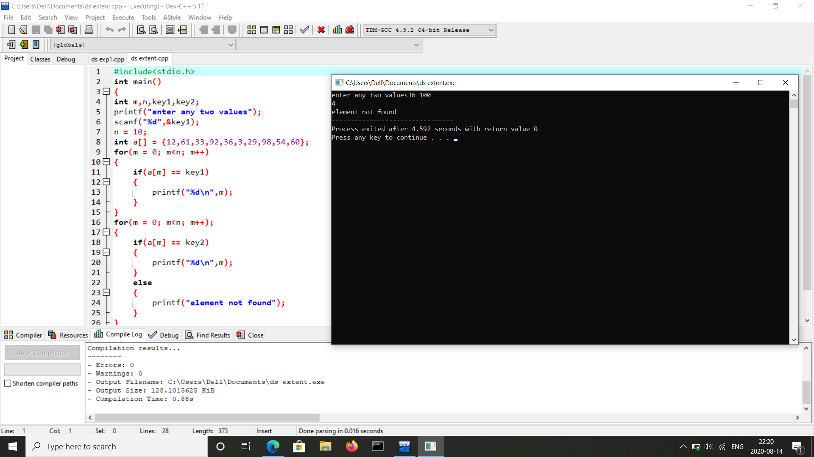

#AIM OF THE EXPERIMENT: Writing linear search program by using iterative functions(non recursive functions).
#LINEAR SEARCH: This search is used to find the presence of the key element in the given array if present then the position of the key element in the given array.(by comparing each element present in the array to the key element).
#PROCEDURE: 
First we have to take the given array which constists of 10 elements i.e. a[i] = [12, 61, 33, 92, 36, 3, 29, 98, 54, 60].
The first element position is considered as "m" which is "0" and the last element position is "n" which is "9".
Given key elements are 36, 100.
we are using for loop here to find out the position and presence of the element(m=0; m<=n; m++)
if the condition a[m] == key is true, then the key element position is printed as output.Since,we have instructed to print the position of the key element.
Given key value is 36 and after the iteration the key element is found at 4 and the output is printed as the position 4.
And the next condition given is if the key element is not present in the given array i.e. m>n then the output is going to be as the element not found.As the key element 100 is not found in the array .
#INPUT:
       36 100
#OUTPUT:
        4
        Element not found
for key 36 100

